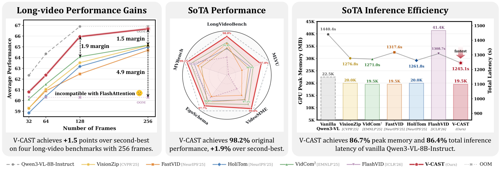
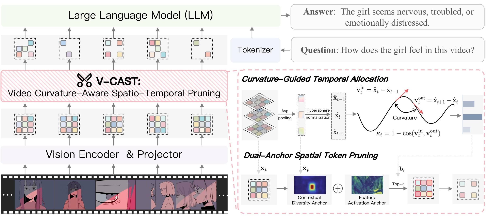

<div align="center">

<h1>✂️ V-CAST: Video Curvature-Aware Spatio-Temporal Pruning for Efficient Video Large Language Models</h1>

<h3>
  <a href="https://github.com/xinyouu">Xinying Lin</a><sup>1,2</sup>,
  <a href="https://github.com/xuyang-liu16">Xuyang Liu</a><sup>3,&dagger;</sup>,
  <a href="https://github.com/lern-to-write">Yiyu Wang</a><sup>4</sup>,
  <a href="https://github.com/MaTengSYSU">Teng Ma</a><sup>1</sup>,
  <a href="https://rwenqi.github.io">Wenqi Ren</a><sup>1,2,✉</sup>
</h3>

<p>
  <sup>1</sup> Shenzhen Campus of Sun Yat-sen University
  &nbsp;&nbsp;
  <sup>2</sup> Shenzhen Loop Area Institute
</p>
<p>
  <sup>3</sup> Sichuan University
  &nbsp;&nbsp;
  <sup>4</sup> EPIC Lab, Shanghai Jiao Tong University
</p>

<p>
  <a href="#"></a>
  <a href="#"></a>
  <a href="https://github.com/xinyouu/V-CAST"></a>
</p>

<p><i>⚡ A training-free and plug-and-play curvature-aware spatio-temporal pruning framework for efficient long-context video inference.</i></p>

</div>

<div align="center">

<a href="#-news">News</a> ·
<a href="#-highlights">Highlights</a> ·
<a href="#-overview">✨ Overview</a> ·
<a href="#-preparation">🛠 Preparation</a> ·
<a href="#-performance-evaluation">🚀 Performance Evaluation</a> ·
<a href="#-citation">📌 Citation</a> ·
<a href="#-acknowledgment">👍 Acknowledgment</a> ·
<span style="white-space: nowrap;"><a href="#-contact">📩 Contact</a></span>

</div>

---

## 🔥 News

- **`2026.03.28`** Released the project page on the `homepage` branch.
- **`2026.03.28`** Refined the public README to better match the current project homepage and paper presentation.
- **`2026.03.27`** Opened the public V-CAST repository.
- **`Soon`** We plan to release cleaner public code for additional model families and evaluation paths.

---

## 🎯 Highlights

- **Curvature-aware spatio-temporal pruning.** V-CAST allocates temporal budget according to video curvature and performs coordinate-preserving spatial pruning.
- **Training-free and plug-and-play.** V-CAST can be integrated into VideoLLMs without retraining.
- **Coverage-oriented compression.** V-CAST explicitly addresses discontinuous coverage and position drift caused by token merging.
- **Strong efficiency-performance trade-off.** V-CAST preserves **98.6%** of original performance, surpasses the second-best baseline by **+1.1%** on average, and reduces peak memory and total latency to **86.7%** and **86.4%** of vanilla Qwen3-VL-8B-Instruct.

---

## ✨ Overview

<p align="center">
  
</p>

> **TL;DR**
>
> V-CAST revisits video token compression from the perspective of **spatio-temporal information coverage**. It combines **curvature-guided temporal allocation** with **coordinate-preserving spatial pruning**, enabling efficient long-context video inference without retraining.

V-CAST is motivated by two key failure modes in prior compression pipelines:

- **Discontinuous coverage**, where uniform or myopic compression misses semantic turns and key events.
- **Misaligned spatio-temporal information**, where token merging drifts away from the original `(t, h, w)` grid and weakens positional bindings.

<p align="center">
  
</p>

---

## 🛠 Preparation

1. Clone the repository:

```bash
git clone https://github.com/xinyouu/V-CAST.git
cd V-CAST
```

2. Browse the project page:

- The polished paper-style homepage is hosted from the `homepage` branch.
- The current `main` branch focuses on the public project overview and figures.

3. Stay tuned for follow-up public releases:

- cleaner evaluation scripts
- model-specific integration paths
- additional released baselines

---

## 🚀 Performance Evaluation

The current public presentation centers on the evaluation setting reported in the paper:

- model family: `Qwen3-VL`
- representative setup: `Qwen3-VL-8B-Instruct`
- evaluation targets: `mlvu_dev`, `mvbench`, `videomme`, `egoschema`, `longvideobench_val_v`

The main findings highlighted in this release are:

- **98.6%** original performance retention under aggressive compression
- **+1.1%** average gain over the second-best baseline
- **86.7%** peak memory of vanilla Qwen3-VL-8B-Instruct
- **86.4%** total latency of vanilla Qwen3-VL-8B-Instruct

For the latest visual presentation of results and analysis, please refer to the project homepage on the `homepage` branch.

---

## 📌 Citation

If you find this repository useful, please cite:

```bibtex
@misc{lin2026vcast,
  title={V-CAST: Video Curvature-Aware Spatio-Temporal Pruning for Efficient Video Large Language Models},
  author={Xinying Lin and Xuyang Liu and Yiyu Wang and Teng Ma and Wenqi Ren},
  year={2026},
  howpublished={\url{https://github.com/xinyouu/V-CAST}}
}
```

---

## 👍 Acknowledgment

This project builds on and benefits from the open-source efforts of:

- Qwen3-VL
- LLaVA
- lmms-eval

---

## 📩 Contact

<span style="white-space: nowrap;"><code>xinyinglin@slai.edu.cn</code></span>
